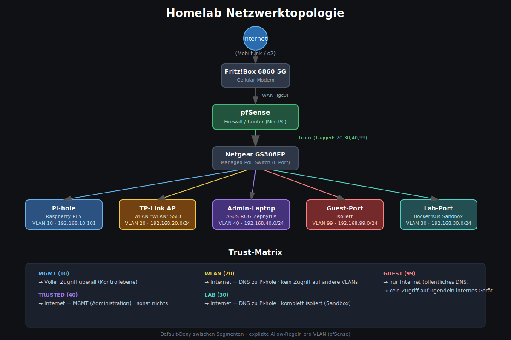

# Homelab — Segmented Network mit pfSense, Pi-hole & VLANs

Ein kabelgebundenes/kabelloses Heimnetz mit sauberer VLAN-Segmentierung, zentralem DNS-Filtering und einer "Default Deny zwischen Segmenten"-Firewall-Philosophie. Aufgebaut und dokumentiert im Rahmen meines Umstiegs in die Cloud/Security-Branche.

## Hardware

| Komponente | Modell | Rolle |
|---|---|---|
| Modem | Fritz!Box 6860 5G | Internet via Mobilfunk (o2) |
| Access Point | TP-Link (WLAN) | Kabelloser Zugang für VLAN 20 |
| Switch | Netgear GS308EP | Managed PoE Switch, 8 Port, VLAN-fähig |
| Firewall/Router | pfSense (Mini-PC) | Routing, Firewalling, DHCP, VLAN-Trunking |
| DNS/Ad-Blocking | Raspberry Pi 5 (Pi-hole) | Netzwerkweites DNS-Filtering |
| Admin-Gerät | ASUS ROG Zephyrus | Trusted-Client für Verwaltung |

## Netzwerk-Architektur

Physischer Aufbau: Fritz!Box → pfSense (WAN) → Switch (Trunk) → Endgeräte je nach VLAN.

pfSense hat ein physisches LAN-Interface (`igc1`), auf dem fünf VLAN-Subinterfaces aufgesetzt sind. Der Switch reicht diese als 802.1Q-Trunk zwischen pfSense und den jeweiligen Access-Ports durch.

### VLAN-Übersicht

| VLAN | Name | Subnetz | Zweck |
|---|---|---|---|
| 10 | MGMT | 192.168.10.0/24 | Kern-Infrastruktur: pfSense, Pi-hole |
| 20 | WLAN | 192.168.20.0/24 | WLAN-Clients (Smartphones etc.) über AP |
| 30 | LAB | 192.168.30.0/24 | Isolierte Sandbox für Docker/Kubernetes/Terraform-Experimente |
| 40 | TRUSTED | 192.168.40.0/24 | Admin-Laptop |
| 99 | GUEST | 192.168.99.0/24 | Besucher-/unbekannte Geräte, maximal isoliert |

### Trust-Matrix (Firewall-Philosophie: Default Deny, explizite Allow-Regeln)

| Von \ Nach | Internet | MGMT | Andere VLANs |
|---|---|---|---|
| **MGMT** | ✅ | ✅ (self) | ✅ (Verwaltung) |
| **TRUSTED** | ✅ | ✅ (Administration) | ❌ |
| **WLAN** | ✅ | ⚠️ nur DNS (Port 53 zu Pi-hole) | ❌ |
| **LAB** | ✅ | ⚠️ nur DNS (Port 53 zu Pi-hole) | ❌ |
| **GUEST** | ✅ (öffentliches DNS) | ❌ | ❌ |

Umgesetzt über pfSense Firewall-Regeln pro Interface, in dieser Reihenfolge (Regel-Priorität von oben nach unten):

1. Allow → DNS zu Pi-hole (Alias `PiHole_DNS`, Port 53) — nur bei WLAN/LAB
2. Block → Zugriff auf private Netze (Alias `RFC1918`, deckt alle internen VLANs ab)
3. Allow → Internet (Rest-Traffic)

Diese Reihenfolge ist entscheidend: pfSense wertet Regeln first-match-wins von oben nach unten aus.

## Switch-Port-Zuordnung (Netgear GS308EP)

| Port | Gerät | VLAN-Konfiguration |
|---|---|---|
| 1 | pfSense (Trunk) | Tagged: 20, 30, 40, 99 · Untagged/PVID: 1 |
| 2 | Access Point | Tagged: 20 · Untagged/PVID: 1 |
| 3 | Pi-hole | Untagged/PVID: 1 |
| 5 | Admin-Laptop | Untagged/PVID: 40 |
| 6 | Guest (kabelgebunden) | Untagged/PVID: 99 |
| 8 | Lab | Untagged/PVID: 30 |
| 4, 7 | frei | VLAN 1 (ungenutzt) |

## Troubleshooting-Postmortem: "WLAN bekommt IP, aber kein Internet"

Ein guter Einblick in echtes Netzwerk-Debugging — drei unabhängige Probleme, die sich gegenseitig überlagert haben:

1. **Pi-hole hatte ein falsches Default Gateway** (Überbleibsel einer alten Netzwerkkonfiguration vor der pfSense-Migration). DNS-Anfragen aus fremden Subnetzen wurden von Pi-hole zwar beantwortet, die Antwortpakete konnten aber nicht zurückgeroutet werden → stiller Blackhole.
   - Diagnose: `ip route show` auf dem Pi-hole zeigte ein Gateway aus einem völlig anderen Subnetz.
   - Fix: `nmcli connection modify "Wired connection 1" ipv4.gateway 192.168.10.1`

2. **Fehlende Isolation zwischen VLANs** — die WLAN-Firewall-Regel war ein pauschales "Allow WLAN → ANY", ohne Trennung zu anderen internen Netzen.

3. **Instabile Mobilfunkverbindung der Fritz!Box** führte zeitgleich zu einem DHCP-Lease-Verlust auf der pfSense-WAN-Schnittstelle — ein komplett unabhängiges Problem, das die Diagnose zusätzlich erschwert hat.

Methodik: Schichtenweise isoliert (Layer 2 VLAN-Tagging → Firewall-Regeln → DNS-Antwortpfad → Routing → WAN-Konnektivität), mit `ping`, `dig`, `nslookup`, `ip route show`, pfSense Diagnostics (Ping mit Source-Interface, States, Packet-Logs) und `journalctl`.

## Roadmap

- [ ] Zweite SSID am AP für Guest-WLAN (VLAN 99) statt nur kabelgebundenem Guest-Port
- [ ] NTP-Synchronisierung auf Pi-hole beheben (Zeitversatz im Dashboard)
- [ ] Mini-PC mit Proxmox für VM/Container-Hosting ergänzen
- [ ] Terraform-gestütztes Deployment für Azure-Testumgebung
- [ ] Docker → Kubernetes (k3s/AKS) → CI/CD-Pipeline

## Über dieses Projekt

Aufgebaut im Rahmen meines Quereinstiegs in die Cloud-/Security-Branche (CompTIA Tech+/Net+/Sec+, Microsoft AZ-900/SC-900, aktuell in Vorbereitung: AZ-104, danach AZ-500).
